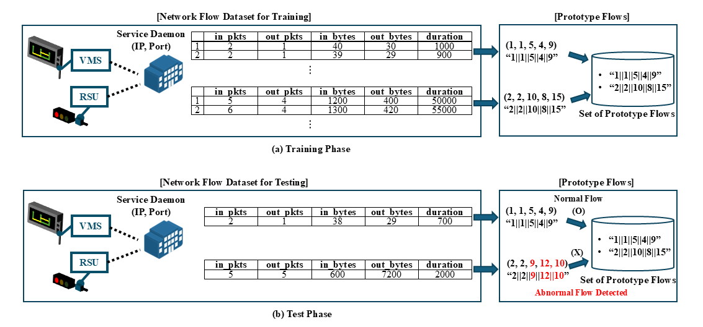

# Flow Identification for C-ITS (FIC)

<p align="center">
    
</p>

This project implements a lightweight, flow-based intrusion detection system using a **signature matching** algorithm. It generates unique signatures for normal network flows from training data and uses them to detect anomalies in test data.

---

## Repository Layout

```
repo/
├─ main.py
├─ flow2sig.py
├─ utils.py
├─ requirements.txt
├─ README.md
├─ .gitignore
├─ docs/
├─ samples/
│ ├─ cicids2017_5_features_train_samples.csv
│ ├─ cicids2017_5_features_test_samples.csv
│ ├─ cicids2017_79_features_train_samples.csv
│ └─ cicids2017_79_features_test_samples.csv
├─ sigsets/
│ ├─ cicids2017_5_features_trained_sigset.npy
│ └─ cicids2017_79_features_trained_sigset.npy
└─ results/
  ├─ cicids2017_5_features_predictions.csv
  └─ cicids2017_79_features_predictions.csv
```

---

## Prerequisites

- Python **3.9+** (3.10+ recommended)
- `pip` package manager

---

## Setup

Install dependencies:
```bash
pip install -r requirements.txt
```

---

## Data Format

- Input files are **CSV** (read via `pandas.read_csv`).
- Columns should be **feature columns only** (this code does not use labels).
- For best results, **train/test should have the same columns in the same order**.

---

## Usage

### Train only — create and save a signature set
```bash
python main.py \
  --train_data train.csv \
  --sigset sigset.npy \
  --base 88
```
- Saves the signature as `sigset.npy`.  
- `--base` is the log discretization base (**must be > 1**).

### Test only — load a saved set and write predictions
```bash
python main.py \
  --test_data test.csv \
  --sigset sigset.npy \
  --result predictions.csv \
  --base 88
```
- Writes `predictions.csv` with **one column**: `y_pred`.

### Train + Test — do both in one run
```bash
python main.py \
  --train_data train.csv \
  --test_data  test.csv  \
  --sigset sigset.npy \
  --result predictions.csv \
  --base 88
```
- Builds and saves the signature set, then immediately tests and saves `y_pred`.

---

## Command-Line Arguments

| Option         | Description                                                                                             | Default            |
|----------------|---------------------------------------------------------------------------------------------------------|--------------------|
| `--train_data` | Train CSV path                                                                                          | –                  |
| `--test_data`  | Test CSV path                                                                                           | –                  |
| `--sigset`     | Signature set path (`.npy`). In **train**: save here; in **test**: load from here       | `sigset.npy`       |
| `--result`     | Path to save predictions (`y_pred`) as CSV                                                              | `predictions.csv`  |
| `--base`       | Log discretization base (**must be > 1**)                                                               | `2`                |

---

## Outputs

- **`sigset.npy`** — NumPy array of `uint64` signatures (fast, exact, compact)
- **`predictions.csv`** — single column **`y_pred`** (length = number of test rows)  
  - `0`: normal / in-set  
  - `1`: anomalous / out-of-set

---